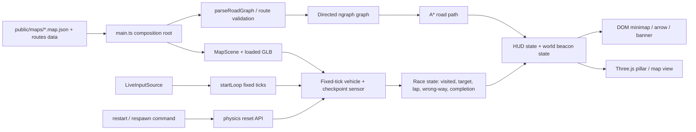

# Phase 5: Objectives, Navigation & Race Modes - Research

**Researched:** 2026-09-21
**Domain:** Fixed-timestep browser game objectives, road-graph navigation, HUD overlays, and race-mode state
**Confidence:** HIGH for repository contracts and existing implementation; MEDIUM for final route placement and Rapier reset details until exercised against the browser build

<user_constraints>
## User Constraints (from CONTEXT.md)

### Locked Decisions

- **D-01:** Checkpoints for both courses are hand-authored in a new sibling data file (e.g.
  `public/maps/juliette-ga.routes.json` or similar — exact name/location is Claude's discretion), not auto-generated from road-graph junction nodes. This follows the project's established hand-authored-deterministic philosophy (phase 04.1's terrain crests were hand-placed the same way) and directly resolves `docs/schemas/road-graph.v1.md`'s own note that "route/checkpoint authoring may move to a sibling file in Phase 5."
- **D-02:** Ship exactly one Point-to-Point course (~5-8 checkpoints) and one Circuit course (~4-6 checkpoints forming the lap) for Juliette, GA in this phase. Do not build a course editor or multiple course variants — that's future-phase scope if ever needed.
- **D-03:** Both courses should intentionally route across mixed surfaces — at least one gravel/dirt stretch per course, not tarmac-only — so the surface-grip mechanic (Phase 3) is actually exercised by the race modes that use it.
- **D-04:** Checkpoint and course placement MUST avoid the known open geometry defect coordinates recorded in `.planning/STATE.md`'s `[Phase 04.1, open]` items (from `04.1-10-SUMMARY.md`'s D-06 sign-off session), until those are fixed in a separate pass:
  - Road-texture rendering gap at (-633.25, -134.43)
  - Ragged/zigzag road-edge geometry at (-420.0, 102.2), (-1227.2, -1062.3) and (-384.66, 229.75)
  - Junction gravel-through-tarmac artifact at (1167.69, 195.84), (891.84, 240.86), (1048.35, 215.10)
  - Building with inverted-normals-looking geometry at (1039.58, 344.87)

  Course/checkpoint authoring should route around these coordinates with reasonable margin rather than through them.
- **D-05:** The checkpoint beacon is a vertical light pillar — a tall, glowing translucent column rising well above building height — not a ring/gate the car drives through. Chosen for visibility from the permanent high-angle helicopter camera and to directly satisfy the "beacon visible over buildings" success criterion.
- **D-06:** Checkpoint detection uses a generous sensor volume — spanning the full road width and tall enough to catch a car airborne over that spot — rather than a precise plane-crossing test. This is a deliberate arcade-feel choice, not a simulation-precision one, and directly targets the "registers even at 150mph or mid-jump" success criterion.
- **D-07:** On checkpoint hit: a short audio chime plays, the beacon changes color (current target vs. visited — exact colors are Claude's discretion), and the arrow/minimap immediately retarget to the next objective. No screen flash or HUD counter-tick animation — feedback stays visual-first and doesn't interrupt the drive.
- **D-08:** Once visited, a checkpoint's beacon disappears entirely (not dimmed, not left visible) — keeps the world-space view and minimap uncluttered as courses progress.
- **D-09:** The minimap is north-up and does not rotate with the car's heading — the car icon rotates on a fixed map instead.
- **D-10:** The minimap is zoomed in and follows the player within a fixed radius (not a whole-course fixed-zoom view), combined with off-screen edge indicators (blips at the map's edge) pointing toward any checkpoint that falls outside the visible radius.
- **D-11:** Minimap visual style is a dark (near-black) background with bright, high-contrast road polylines and colored dots for checkpoints — a tactical/broadcast-map look, not a translucent world-overlay.
- **D-12:** The minimap sits in the bottom-left corner of the screen. This deliberately reserves the top-right corner for the existing speedometer and Phase 6's planned medal-split HUD, and the top-left for future mission-brief text, so neither collides with the minimap later.
- **D-13:** The Circuit course is 3 laps.
- **D-14:** Wrong-way state is signalled with a clear on-screen "WRONG WAY" HUD banner plus a subtle red vignette/tint at the screen edges.
- **D-15:** Instant level restart includes a very brief (~100-150ms) screen flash/fade — not a true zero-transition hard cut — while still comfortably meeting the "well under a second, no loading screen" success criterion.

### Claude's Discretion

- **Respawn-at-last-checkpoint time penalty amount (D-16 placeholder):** Pick a specific flat penalty value and document the reasoning for later tuning.
- **Exact sibling checkpoint-file name/location and its schema shape** (D-01): follow `src/core/crest-geometry.ts`'s precedent unless a JSON sidecar proves more consistent with `road-graph.v1.md`'s file-family conventions.
- **The road-aware directional arrow's visual presentation:** NAV-04 requires following the actual road path via `ngraph.path`; its on-screen form is open.
- Exact checkpoint colors, chime sound design, and edge-indicator blip visual style.
- Exact P2P/Circuit checkpoint node/coordinate picks on the real map.

### Deferred Ideas (OUT OF SCOPE)

None raised in the phase discussion. AI racers/pursuers, medal timing/best-time persistence, and additional map area remain outside this phase boundary as stated in the phase context.
</user_constraints>

<phase_requirements>
## Phase Requirements

| ID | Description | Research Support |
|----|-------------|------------------|
| NAV-03 | Always-on minimap with remaining checkpoints and player position | RoadGraph already supplies `edges[].points` and `bounds`; a new player-facing `src/hud/` canvas overlay can follow the fixed north-up/follow-radius contract. |
| NAV-04 | World-space beacon plus road-aware directional arrow | Beacons belong in the Three.js map view; route guidance belongs in a pure graph/path service using the existing ngraph adapter and a render/HUD presentation layer. |
| NAV-05 | Nearest unvisited target for unordered modes; next sequence target for ordered modes | Course state should own visited/next-target selection; navigation should consume the selected checkpoint, never infer mode rules itself. |
| NAV-06 | Respawn at last checkpoint, upright/correctly facing, with small penalty | `Vehicle.body` is accessible but `MapScene` exposes no reset/respawn contract; add a physics-owned reset operation and keep penalty/run-time state in gameplay/core, not in render or input. |
| NAV-07 | Instant restart with one key, under one second and no loading screen | Reuse loaded graph/collision/map view and reset the existing world/vehicle state in place; do not refetch assets or recreate the browser loop. |
| P2P-01 | Complete one P2P course by hitting all checkpoints in any order via any route | Hand-authored route data plus unordered target selection; route validation must ensure each checkpoint maps to a reachable graph node/road location. |
| CIRC-01 | Complete one ordered checkpoint loop across N laps | Ordered course state with 3 laps, explicit lap transition, completion state, and wrong-way handling. |
</phase_requirements>

## Summary

[VERIFIED: codebase] Phase 5 has a stable composition root in `src/main.ts`: it fetches and parses the graph/collision artifacts, loads the GLB, constructs `MapScene`, creates the vehicle view and player-facing HUD, selects the helicopter camera, and calls `startLoop`. [VERIFIED: codebase] `src/loop.ts` already provides the necessary fixed-timestep ordering and an `onTickEnd` hook, but currently passes `null` for Rapier events and has no gameplay reset callback. The safest implementation is a gameplay coordinator inserted into this existing wiring, with pure course/objective/navigation logic separated from DOM and Three.js presentation.

[VERIFIED: codebase] The real Juliette artifact is a 50-node, 64-edge dense road graph with 47 tarmac, 9 dirt-road, and 8 gravel edges; it has one `default` spawn at node 16. [VERIFIED: codebase] The schema stores edges undirected and requires consumers to reconstruct direction from `oneway`. [VERIFIED: codebase] The existing compiler validator already proves the exact `ngraph.graph`/`ngraph.path` shape needed by Phase 5. Use that adapter rather than introducing another pathfinding library. Route authoring remains the highest-content risk: the planner must choose concrete nodes/coordinates, include a non-tarmac stretch in both courses, and avoid all Phase 04.1 defect coordinates.

**Primary recommendation:** Add a small pure race-domain layer (`course`/`objective`/`navigation` state), a physics-owned in-place vehicle reset API, and player-facing HUD/world-beacon modules wired through `main.ts`; keep all run clocks and checkpoint mutation on fixed ticks, use render frames only for interpolation and visual updates, and keep the loaded map/loop alive for retry.

## Architectural Responsibility Map

| Capability | Primary Tier | Secondary Tier | Rationale |
|------------|-------------|----------------|-----------|
| Course/checkpoint data validation | Browser / Client (`src/core`) | Static `public/maps` data | Course data is deterministic shipped content; pure validation can run in Vitest and at load time. |
| Checkpoint progression and mode rules | Browser / Client (`src/core` or gameplay tier) | Fixed loop | P2P unordered selection, Circuit ordering/laps, completion, and wrong-way state are simulation-domain decisions. |
| Road graph/path queries | Browser / Client (`src/core`) | `ngraph.graph`/`ngraph.path` | The graph is loaded in the browser and already has a validated directed adapter in the compiler. |
| Vehicle respawn/restart mutation | Physics | Fixed loop/composition root | Rapier body/controller state must be reset before a fixed step; render must never write physics state. |
| Beacon and map geometry | Render | Core objective state | Three.js owns world-space pillars and map polylines; it reads immutable checkpoint state. |
| Minimap, wrong-way banner, lap/target feedback | Browser DOM HUD (`src/hud`) | Core objective state | Existing player HUD uses DOM overlays with `pointer-events:none`; keep HUD free of engine imports and simulation writes. |
| Keyboard/gamepad command capture | Input | Composition root | `src/input` already latches hardware per tick; gameplay commands should be added without making input mutate world state. |
| Run clock and penalty accounting | Fixed-tick gameplay/core | `SimClock` | `SimClock.simTimeSec` is the only reproducible time source; do not read wall clock in objectives/HUD. |

## Standard Stack

### Core

| Library / existing contract | Version | Purpose | Why standard here |
|------------------------------|---------|---------|------------------|
| TypeScript + Vite | `7.0.2` / `8.2.2` [VERIFIED: package.json] | Browser build and typed contracts | Existing project stack; top-level await and WASM configuration are already working. |
| Three.js | `0.185.1` [VERIFIED: package.json] | Map, beacon pillars, minimap-independent world rendering, camera | Existing renderer/map view; do not add a second rendering system for objectives. |
| Rapier3D | `0.20.0` [VERIFIED: package.json] | Vehicle physics and in-place body reset | Existing `MapScene` and `Vehicle`; reset must use the existing body/controller. |
| `ngraph.graph` | `20.1.2` [VERIFIED: package.json and `tools/map-compiler/validate/validator.ts`] | Directed weighted road graph | Already used in the repository with dense node IDs and edge weights. |
| `ngraph.path` | `1.6.1` [VERIFIED: package.json and `tools/map-compiler/validate/validator.ts`] | A* route queries | Already proven with `aStar(...).find()` against this graph shape. |
| DOM HUD APIs | Browser platform [VERIFIED: `src/hud/speedometer.ts`, `index.html`] | Minimap, lap, wrong-way, retry feedback | Existing speedometer and camera chrome establish the player-facing overlay convention. |

### Supporting

| Existing module | Use in Phase 5 |
|-----------------|----------------|
| `src/core/road-graph.ts` [VERIFIED: codebase] | Parse the existing `*.map.json`; do not change schema v1 for route data. |
| `src/physics/map-scene.ts` [VERIFIED: codebase] | Reuse map colliders and expose a narrowly scoped reset/spawn contract. |
| `src/physics/vehicle.ts` [VERIFIED: codebase] | Reuse generic `createVehicle`; body has Rapier setters used elsewhere in telemetry, but a reset helper needs explicit validation. |
| `src/render/map-view.ts` [VERIFIED: codebase] | Reuse the loaded GLB group and road/building mesh arrays. |
| `src/render/camera/camera-skin.ts` [VERIFIED: codebase] | Set the existing camera skin to `sports` for both race modes; this is already a presentation-only switch. |
| `src/core/sim-clock.ts` [VERIFIED: codebase] | Derive run time from `tick * DT`; do not create a second clock. |

**Installation:** No new external package is recommended. Existing exact-pinned `ngraph.graph` and `ngraph.path` are sufficient.

## Package Legitimacy Audit

No package installation is required for this phase. [VERIFIED: package.json] All recommended external packages are already exact-pinned in the repository. The planner should not add a new pathfinding, HUD, state, or physics package for this scope.

## Architecture Patterns

### System Architecture Diagram



### Recommended Project Structure

```text
src/
├── core/
│   ├── course.ts             # validated route/checkpoint data and pure course rules
│   ├── navigation.ts         # directed ngraph construction and road-path queries
│   └── race-state.ts         # P2P/Circuit progression, respawn penalty, wrong-way state
├── physics/
│   └── map-scene.ts           # existing scene plus narrow reset/respawn operation
├── render/
│   └── objective-view.ts      # Three.js beacon pillars and visibility lifecycle
├── hud/
│   ├── minimap.ts             # fixed north-up canvas, follow radius, edge indicators
│   ├── race-hud.ts            # target/lap/wrong-way/retry feedback
│   └── navigation-arrow.ts    # road-aware arrow presentation, if DOM form is chosen
└── main.ts                    # load route data, compose race coordinator, wire loop callbacks
public/maps/
└── juliette-ga.routes.json    # recommended sibling sidecar for hand-authored content
```

The exact filenames are discretionary. [VERIFIED: `src/core/crest-geometry.ts` precedent] The route sidecar should be deterministic, small, explicit, and validated field-by-field. [VERIFIED: `docs/schemas/road-graph.v1.md`] Keeping route data as a sibling artifact avoids changing the normative road graph schema and matches its explicit Phase 5 note.

### Pattern 1: Build the directed graph exactly like the compiler validator

[VERIFIED: `tools/map-compiler/validate/validator.ts`] Add every graph node by dense `id`; add `from -> to` for every edge, and add `to -> from` only when `oneway` is false. Store `{ weight: edge.lengthM, edgeId }` or an equivalent immutable link payload. Use `aStar(graph, { distance: (_from, _to, link) => link.data.weight })`; `find(fromId, toId)` returns the node path used to derive road-following guidance.

Do not use Euclidean bearing as the road-aware arrow source. The current `src/debug/nav-pointer.ts` is a straight-line coordinate pointer and is explicitly a temporary debug tool; it is useful for bearing math tests but does not satisfy NAV-04.

### Pattern 2: Fixed-tick race progression, render-only presentation

[VERIFIED: `src/loop.ts`] Use `onTickEnd` for checkpoint sensor/progression after `world.step()` so the chassis has its post-step position and any Rapier event path remains available. Use `render(alpha, dtMs)` only to update interpolated mesh/beacon/HUD presentation. [VERIFIED: `src/core/sim-clock.ts`] Run time and flat respawn penalty accounting must be based on `clock.simTimeSec` or tick counts, not `performance.now()`.

Checkpoint volumes should be represented by pure XZ/Y bounds or a core sensor object and checked against the post-step chassis position. [ASSUMED: the planner should prefer geometric containment over Rapier sensor colliders unless a concrete event-queue need emerges] The generous sensor must span the road width and sufficient Y height for a jump, and should use a debounced/visited check so a car remains inside for multiple ticks without duplicate progression.

### Pattern 3: Separate mode policy from objective presentation

The race state owns `currentTargetId`, visited IDs, lap number, completion, wrong-way, and retry anchors. P2P selects the nearest unvisited checkpoint by route distance or A* path cost; Circuit selects the next authored checkpoint index. The minimap, arrow, beacon view, and HUD receive a read-only snapshot and never decide whether a checkpoint is valid.

For P2P, "nearest" should mean the shortest traversable road-path cost from the car's current road node/edge, not straight-line distance, because NAV-04 requires road-aware guidance and D-02 permits any route. [ASSUMED: a nearest-node projection helper will be needed to map a car/checkpoint coordinate onto the graph; exact projection strategy needs a small focused implementation decision]

### Pattern 4: Reuse loaded scene for retry

[VERIFIED: `src/physics/telemetry/routines.ts`] Existing code uses Rapier body setters (`setTranslation`, `setLinvel`, `setAngvel`) for controlled repositioning. A production respawn/reset should also set rotation, clear angular/linear velocity, wake the body, and reset any vehicle-controller transient state that is exposed by the installed Rapier API. [MEDIUM: Rapier API behavior] Validate this with a focused headless test and a browser retry checkpoint because controller state and suspension settling are runtime-sensitive.

A full-level restart should reset race state, restore the authored start transform, reset beacons/minimap, and preserve the loaded map/collision/GLB and `startLoop` handle. Do not call `location.reload`, refetch artifacts, or create a second `World` in the key handler.

### Pattern 5: Follow existing HUD and camera-skin conventions

[VERIFIED: `src/hud/speedometer.ts`] Player HUD factories append DOM elements to `document.body`, use `pointer-events:none`, and expose `update`/`dispose` handles. [VERIFIED: `tests/layering.test.ts`] `src/hud` must not import Three.js/Rapier or write simulation state. A minimap can own a 2D canvas and draw road polylines from `RoadGraphEdge.points`; it must remain a DOM HUD rather than a second Three.js camera.

[VERIFIED: `src/render/camera/camera-skin.ts`] Race mode should call `skin.set("sports")` after creating the existing switcher. The module changes only CSS classes/chrome and must not be expanded to own race state or camera distances.

## Don't Hand-Roll

| Problem | Don't Build | Use Instead | Why |
|---------|-------------|-------------|-----|
| Road pathfinding | Straight-line arrow or new custom A* | Existing `ngraph.graph` + `ngraph.path` adapter | The repository already validates this exact directed weighted shape. |
| Fixed-step timing | `Date.now()`, `performance.now()`, or a HUD timer | `SimClock.simTimeSec` / tick index | Preserves framerate-independent run times and future medal comparability. |
| Map minimap geometry | A second 3D minimap camera | 2D canvas over existing `edges[].points` | The road graph already contains the renderable polylines and avoids a second scene pass. |
| Camera reskin | New race camera rig | `CameraSkinSwitcher.set("sports")` | CAM-03 is already implemented as presentation-only CSS/chrome. |
| Route auto-authoring | Junction selection heuristic/editor | Hand-authored sibling route data | D-01/D-02 require deterministic designer-selected courses and avoid known geometry defects. |
| HUD DOM security | HTML string injection | `textContent`, direct DOM APIs | Existing repository rule and layering tests ban `innerHTML`. |
| Physics replacement on retry | Recreate whole world/vehicle per key press | In-place Rapier body/controller reset | Keeps loaded assets and loop alive, enabling sub-second retry. |

## Common Pitfalls

### Pitfall 1: Treating the existing debug nav pointer as NAV-04

**What goes wrong:** `src/debug/nav-pointer.ts` computes a direct bearing and distance to an arbitrary coordinate. It ignores roads, one-way direction, and route cost. [VERIFIED: codebase]

**How to avoid:** Keep it as debug tooling; route the player arrow from the ngraph path's next edge/waypoint. Add tests where the straight line and shortest legal road route disagree.

### Pitfall 2: Sampling checkpoint state in `render`

**What goes wrong:** A render-only check can miss a fast crossing when one render frame contains multiple fixed steps. [VERIFIED: `src/loop.ts` onTickEnd contract]

**How to avoid:** Check after each `world.step()` via `onTickEnd` or a fixed-tick gameplay callback. Make repeated occupancy idempotent.

### Pitfall 3: Resetting only position

**What goes wrong:** Residual velocity, rotation, angular velocity, suspension/controller state, or interpolation buffers can make the car slide/teleport immediately after respawn. [MEDIUM: existing Rapier usage plus runtime behavior to verify]

**How to avoid:** Reset translation, rotation, linear velocity, angular velocity, wake state, and transform-cache previous/current poses together; then allow suspension to settle before accepting a checkpoint or declaring a clean restart.

### Pitfall 4: Rewinding `SimClock` or using wall time for penalties

**What goes wrong:** Rewinding tick state or adding a wall-clock timeout makes the run non-reproducible and risks changing future medal times. [VERIFIED: `src/core/sim-clock.ts` project contract]

**How to avoid:** Keep the monotonic clock unchanged. Store a flat penalty accumulator (recommended starting value: **5 seconds**) in race state and display effective run time as `simTimeSec + penaltySec`. The 5-second value is a reasoned starting default, not a locked balance decision: large enough to discourage casual resets, small enough not to punish a single missed corner more than the drive itself.

### Pitfall 5: Letting world beacons and minimap retain visited objectives

**What goes wrong:** The high-angle view and tactical map become cluttered as the course progresses, contrary to D-08. [VERIFIED: context decision]

**How to avoid:** Treat visited state as authoritative and remove/hide visited beacon meshes and dots immediately after a hit; do not merely recolor them in the player view.

### Pitfall 6: Authoring checkpoints at node 34-36 mixed-surface defects

**What goes wrong:** The required gravel section is tempting near the southeast mixed-surface junction, but the known gravel-through-tarmac artifacts are at nearby real coordinates. [VERIFIED: `STATE.md`, `05-CONTEXT.md`]

**How to avoid:** Use the safer gravel branch around nodes 6/33/42 or dirt-road branches around nodes 15/46/48 after inspecting actual edge polylines, and keep a measured margin from all four defect groups. The route validator should report nearest defect distance for authored checkpoint/edge samples.

### Pitfall 7: Treating the map's huge bounds as a useful minimap scale

**What goes wrong:** The real bounds span roughly 5.5 km X by 5.7 km Z, while the drivable network has close and distant branches; a whole-course fixed map makes local roads unreadable. [VERIFIED: parsed `public/maps/juliette-ga.map.json` bounds]

**How to avoid:** Use D-10's player-centered fixed-radius projection and clamp off-screen checkpoint indicators to the minimap perimeter. North-up means world X/Z mapping stays stable and only the car marker rotates.

### Pitfall 8: Violating HUD/render layering

**What goes wrong:** Importing Rapier/Three into `src/hud`, mutating physics from a visual module, or adding another render pass breaks existing mechanical layering/performance assumptions. [VERIFIED: `tests/layering.test.ts`, `src/render/renderer.ts`]

**How to avoid:** Pass plain snapshots into HUD/view modules. Keep all physics mutation in `src/physics`, all route rules in pure core/gameplay modules, and keep one main renderer draw per frame.

## Code Examples

### Directed road graph and A* query

```ts
import createGraph from "ngraph.graph";
import { aStar } from "ngraph.path";
import type { RoadGraph } from "./road-graph";

export function buildNavigationGraph(graph: RoadGraph) {
  const navigation = createGraph<undefined, { weight: number; edgeId: number }>();
  for (const node of graph.nodes) navigation.addNode(node.id);
  for (const edge of graph.edges) {
    navigation.addLink(edge.from, edge.to, { weight: edge.lengthM, edgeId: edge.id });
    if (!edge.oneway) {
      navigation.addLink(edge.to, edge.from, { weight: edge.lengthM, edgeId: edge.id });
    }
  }
  return navigation;
}

export function findRoadPath(navigation: ReturnType<typeof buildNavigationGraph>, from: number, to: number) {
  const finder = aStar(navigation, {
    distance: (_from, _to, link) => link.data.weight,
  });
  return finder.find(from, to);
}
```

[VERIFIED: adapted directly from `tools/map-compiler/validate/validator.ts`; the added `edgeId` is the planner's required payload for turning node paths into road-following waypoints]

### Existing fixed-loop seam

```ts
startLoop({
  world,
  input,
  transforms,
  applyInput: scene.applyInput,
  onTickBegin: scene.preTick,
  onTickEnd: (tick) => race.onTickEnd(tick, scene.vehicle),
  render: (alpha, dtMs) => race.render(alpha, dtMs),
});
```

[VERIFIED: `LoopDeps` in `src/loop.ts`] The actual implementation must decide whether `onTickEnd` needs an event queue extension; the current loop invokes it with `null`, so checkpoint logic should not depend on Rapier collision events without first changing that contract and adding focused coverage.

### Existing player HUD shape

```ts
const speedo = createSpeedometer();
// per render frame:
speedo.update(groundSpeedMs, dtMs);
```

[VERIFIED: `src/main.ts` and `src/hud/speedometer.ts`] New race HUD modules should follow the same factory/update/dispose shape and use direct DOM writes/textContent.

## Real Map / Course Authoring Notes

[VERIFIED: parsed `public/maps/juliette-ga.map.json`] The artifact has bounds `minX=-3759.53`, `maxX=1744.63`, `minZ=-2474.21`, `maxZ=3182.55`; node IDs are dense 0 through 49; the only spawn is node 16 at `(-225.1, 451.4)` with heading `-1.742` radians. [VERIFIED: parsed artifact] Mixed-surface options include dirt-road edges around nodes 15/19/46/48 and gravel edges around nodes 6/33/34/35/36/42.

[VERIFIED: `STATE.md` and phase context] Do not use the three gravel/tarmac defect coordinates near `(1167.69,195.84)`, `(891.84,240.86)`, `(1048.35,215.10)`, nor the texture, ragged-edge, or building defect coordinates. The planner should make route authoring a concrete early task, with a small route-validation script/test that checks checkpoint bounds, checkpoint-to-road distance, graph reachability, surface coverage, and defect-clearance margin.

Recommended content strategy: author checkpoints on safe graph nodes/edge samples, not arbitrary far-from-road coordinates. Use one dirt-road branch for one course and one gravel branch for the other if possible, so each mode exercises a different surface family while satisfying D-03. The exact picks remain an open authoring decision and should be verified visually in the browser.

## Validation Architecture

### Test Framework

| Property | Value |
|----------|-------|
| Framework | Vitest `5.0.0` [VERIFIED: `package.json`] |
| Config file | `vitest.config.ts` [VERIFIED: codebase] |
| Quick run command | `npm test -- --run tests/<phase-test>.test.ts` |
| Full suite command | `npm test` or `npm run check` |

### Phase Requirements -> Test Map

| Req ID | Behavior | Test Type | Automated Command | File Exists? |
|--------|----------|-----------|-------------------|-------------|
| NAV-03 | North-up player-follow minimap, road lines, remaining checkpoint dots, off-screen indicators | unit + DOM-free projection tests; browser smoke for canvas | `npm test -- --run tests/minimap.test.ts` | No, Wave 0 |
| NAV-04 | Directed path produces route-aware next waypoint/arrow target; beacon target matches objective | unit + browser smoke | `npm test -- --run tests/navigation.test.ts` | No, Wave 0 |
| NAV-05 | P2P nearest-unvisited and Circuit next-in-order selection | unit | `npm test -- --run tests/race-state.test.ts` | No, Wave 0 |
| NAV-06 | Checkpoint respawn pose, upright heading, flat penalty, no residual velocity | physics integration | `npm test -- --run tests/respawn.test.ts` | No, Wave 0 |
| NAV-07 | Restart resets objective/vehicle state in place and does not reload/refetch | unit/integration plus browser timing smoke | `npm test -- --run tests/restart.test.ts` | No, Wave 0 |
| P2P-01 | All unordered checkpoints can be completed; repeated checkpoint hits are idempotent | unit + real route artifact validation | `npm test -- --run tests/course-data.test.ts tests/race-state.test.ts` | No, Wave 0 |
| CIRC-01 | Ordered checkpoint loop advances exactly three laps and completes | unit + browser smoke | `npm test -- --run tests/race-state.test.ts` | No, Wave 0 |

### Existing non-regression checks to preserve

[VERIFIED: `package.json`, existing tests] Run `npm run typecheck`, `npm run lint`, and `npm test`; the project also has `npm run check`. [VERIFIED: `.planning/STATE.md`] The vehicle telemetry suite currently has a known-red accel/brake band issue after the developer's hand tuning; do not attribute that unrelated failure to Phase 5 or silently retune it.

### Wave 0 Gaps

- [ ] Add pure course/routes schema parser and route-data fixture coverage.
- [ ] Add directed navigation graph/path tests, including one-way handling and a case where Euclidean direction differs from legal road direction.
- [ ] Add race-state tests for P2P, Circuit/3 laps, idempotent checkpoint hits, completion, wrong-way state, and 5-second default penalty once accepted.
- [ ] Add minimap projection tests for north-up orientation, car rotation, follow radius, and edge indicators.
- [ ] Add physics reset/restart integration tests against `createMapScene` and a focused browser checkpoint for visual settling/flash timing.
- [ ] Add real-route validation for checkpoint road proximity, reachability, mixed surfaces, and clearance from the four defect groups.

## Security Domain

| ASVS Category | Applies | Standard Control |
|----------------|---------|------------------|
| V2 Authentication | No | No authentication in this desktop-first local game. |
| V3 Session Management | No | No server session; run state is in memory. |
| V4 Access Control | No | No multi-user resource boundary. |
| V5 Input Validation | Yes | Parse route JSON field-by-field like `parseRoadGraph`; clamp/validate coordinates, node IDs, checkpoint counts, lap count, and route references. Treat localStorage only as untrusted if Phase 5 adds restart preferences. |
| V6 Cryptography | No | No cryptographic operation in scope. |

### Known Threat Patterns for this stack

| Pattern | STRIDE | Standard Mitigation |
|---------|--------|---------------------|
| Malformed hand-authored route JSON | Tampering / denial of service | Strict parser with named artifact errors; never spread raw JSON into runtime state. |
| HTML injection through route/HUD labels | Tampering | Static labels and `textContent`; never `innerHTML`. |
| Unbounded checkpoint coordinates or path queries | Denial of service | Validate finite values and bounded counts before building meshes/pathfinders. |
| Accidental wall-clock gameplay state | Tampering with timing integrity | Mechanical layering test and pure fixed-tick race state. |

## Open Questions

1. **Which exact nodes/edge samples should define the two courses?**
   - What we know: the graph is dense, reachable, and contains safe dirt/gravel branches.
   - What's unclear: visual quality, checkpoint visibility, and whether a candidate circuit reads as a satisfying three-lap loop under the near-overhead camera.
   - Recommendation: make authoring a planner task backed by a real-artifact validator and browser drive; do not infer routes solely from node count.

2. **Should route data be JSON or a TypeScript data module?**
   - What we know: both are compatible with D-01; `crest-geometry.ts` is the closest hand-authored precedent, while the map artifacts are JSON sidecars.
   - Recommendation: use `public/maps/juliette-ga.routes.json` so content is loaded beside the map and can be inspected/replaced without bundling; validate it through a dedicated parser. If the planner chooses a TS module for stronger compile-time literals, preserve a pure parser/test contract.

3. **What exact Rapier reset semantics are needed for the vehicle controller?**
   - What we know: body setters are already used in telemetry and `Vehicle.dispose` only removes the controller; `MapScene` currently has no reset method.
   - What's unclear: whether the installed controller needs explicit wheel/impulse state clearing beyond body pose/velocities and wake-up.
   - Recommendation: implement the smallest physics reset helper, then verify with a headless integration test plus a browser retry drive. Do not guess from a generic Rapier tutorial.

4. **Should checkpoint detection use geometric containment or Rapier sensor colliders?**
   - What we know: the loop has an `onTickEnd` seam but passes no event queue; geometric tests can work directly from post-step position and satisfy generous-volume requirements.
   - What's unclear: whether sensor events are needed for future moving racers, which is out of scope here.
   - Recommendation: use pure containment for Phase 5 unless a measured airborne/fast-crossing test proves inadequate; leave event queue support as a separate loop contract change if needed.

5. **Which road-aware arrow presentation is best?**
   - What we know: the path must use ngraph; the current debug arrow is DOM and straight-line only.
   - Recommendation: use a compact fixed HUD arrow in the top-center or near the minimap, because it avoids adding another world-space object and can consume a path-derived relative bearing. Keep the beacon as the world-space "where" signal.

## Environment Availability

| Dependency | Required By | Available | Version | Fallback |
|------------|-------------|-----------|---------|----------|
| Node.js | Vite/Vitest/typecheck | ✓ | Repository requires >=24 [VERIFIED: `package.json`] | None needed |
| npm | Existing scripts and pinned dependencies | ✓ | Present in session [VERIFIED: existing terminal context] | None needed |
| Three.js | Map/beacon/render | ✓ | 0.185.1 [VERIFIED: `package.json`] | None needed |
| Rapier3D | Vehicle/map physics | ✓ | 0.20.0 [VERIFIED: `package.json`] | None needed |
| ngraph.graph | Directed graph | ✓ | 20.1.2 [VERIFIED: `package.json`] | None needed |
| ngraph.path | A* | ✓ | 1.6.1 [VERIFIED: `package.json` and compiler tests] | None needed |
| Chromium/browser manual checkpoint | HUD, camera, beacon, retry feel | Not verified by this research session | — | Planner should include a human browser checkpoint; automated pure tests remain available |

## Project Constraints (from CLAUDE.md)

- [VERIFIED: `CLAUDE.md`] Use Three.js + Rapier3D + TypeScript + Vite; desktop browser first; code-driven low-poly assets; no real manufacturer names/logos/exact reproductions.
- [VERIFIED: `CLAUDE.md`] The fixed-timestep loop is non-negotiable; run timing must remain deterministic.
- [VERIFIED: `CLAUDE.md`] Use existing project conventions and do not introduce an ECS or unrelated framework for this scope.
- [VERIFIED: `CLAUDE.md`] `src/core` remains pure; `src/physics` must not import Three.js; `src/render` and `src/hud` must not mutate simulation state; `src/loop.ts` remains the sole rAF/wall-clock owner.
- [VERIFIED: `CLAUDE.md`] Existing exact-pinned dependencies and the required Vite Rapier `optimizeDeps.exclude` configuration must remain intact.
- [VERIFIED: `CLAUDE.md`] Map data remains OpenStreetMap/open-data derived under the existing attribution/legal decisions; do not add Google-sourced bytes.
- [VERIFIED: `CLAUDE.md`] GSD workflow requires phase research before planning; this artifact is research only and does not modify production source or tests.

## State of the Art

| Old/current project approach | Phase 5 approach | Impact |
|------------------------------|------------------|--------|
| Temporary debug straight-line `nav-pointer` | Directed ngraph route path + objective target | Satisfies road-aware navigation and one-way constraints. |
| Single `default` map spawn only | Authored start/checkpoint respawn transforms | Enables P2P/Circuit retry without rebuilding the area. |
| Speedometer as the only player HUD | Reusable DOM HUD tier plus 2D tactical minimap | Adds navigation without a second Three.js render pass. |
| Debug camera skin cycle | Race state explicitly selects `sports` | Activates the already-built CAM-03 race presentation. |

**Deprecated/outdated for this phase:**
- [VERIFIED: phase context] Do not use a whole-course fixed minimap, heading-up rotation, ring checkpoints, precise plane crossings, or a hard-cut restart; these contradict locked decisions.
- [VERIFIED: requirements/context] Do not add medal thresholds/timers, AI racers, pursuers, or persistence; those belong to later phases.

## Assumptions Log

| # | Claim | Section | Risk if Wrong |
|---|-------|---------|---------------|
| A1 | Pure geometric checkpoint containment is sufficient without Rapier sensor events. | Architecture Pattern 2 / Open Question 4 | Fast airborne crossings could be missed; requires an integration/browser check. |
| A2 | The car/checkpoint can be mapped to a useful nearest graph node/edge with a small projection helper. | Architecture Pattern 3 | P2P target selection could be wrong on close parallel roads; validate with real route data. |
| A3 | Rapier body pose/velocity reset plus wake-up is sufficient after controller reuse. | Architecture Pattern 4 / Open Question 3 | Residual controller/suspension state could cause unstable retries; must be tested. |
| A4 | A 5-second flat respawn penalty is an appropriate starting value. | Pitfall 4 | Balance may feel too punitive or too forgiving; document and tune during playtest without changing time-source semantics. |
| A5 | A fixed HUD arrow is preferable to a 3D arrow for the open NAV-04 presentation choice. | Open Question 5 | Browser playtest may show the arrow needs stronger world-space context. |

## Sources

### Primary (HIGH confidence)

- [VERIFIED: `05-CONTEXT.md`] Locked Phase 5 boundary and decisions D-01 through D-15.
- [VERIFIED: `.planning/STATE.md`] Open geometry defects, known-red vehicle telemetry concern, and project constraints.
- [VERIFIED: `.planning/ROADMAP.md`] Phase dependency, scope, and sequencing.
- [VERIFIED: `.planning/REQUIREMENTS.md`] NAV-03 through NAV-07, P2P-01, and CIRC-01 definitions.
- [VERIFIED: `src/main.ts`] Current composition root and render/tick wiring.
- [VERIFIED: `src/loop.ts`, `src/core/sim-clock.ts`] Fixed-step callback order, timing contract, and retry implications.
- [VERIFIED: `src/core/road-graph.ts`, `docs/schemas/road-graph.v1.md`] Road graph schema, dense IDs, undirected storage, and spawn shape.
- [VERIFIED: `tools/map-compiler/validate/validator.ts`, `tools/map-compiler/validate/validator.test.ts`] Existing ngraph graph construction and A* usage.
- [VERIFIED: `src/physics/map-scene.ts`, `src/physics/vehicle.ts`] Map/vehicle ownership, spawn construction, and generic vehicle API.
- [VERIFIED: `src/hud/speedometer.ts`, `src/hud/map-credit.ts`, `src/render/camera/camera-skin.ts`, `tests/layering.test.ts`] HUD, camera-skin, and layering patterns.
- [VERIFIED: `public/maps/juliette-ga.map.json`] Real map topology, bounds, surfaces, and spawn data, summarized during this research session.
- [VERIFIED: `package.json`] Exact package versions and validation scripts.

### Secondary (MEDIUM confidence)

- [MEDIUM: existing Rapier setter usage in `src/physics/telemetry/routines.ts`] Body reset operations are available in the installed bindings; full controller reset semantics still need runtime verification.

### Tertiary (LOW confidence)

- None used for implementation claims. The remaining uncertainty is repository-specific behavior that should be tested, not an external ecosystem claim.

## Metadata

**Confidence breakdown:**
- Standard stack: HIGH - exact-pinned dependencies and existing source usage were inspected.
- Architecture: HIGH - composition, loop, map, HUD, camera, and layering contracts were read directly.
- Route authoring: MEDIUM - topology is verified, but final visual course quality and defect-clearance margins require browser validation.
- Retry physics: MEDIUM - existing body setter usage is verified, but controller settling/reset behavior is not yet verified.

**Research date:** 2026-09-21
**Valid until:** 2026-10-21 for repository contracts; re-check package/runtime assumptions sooner if dependencies change.
