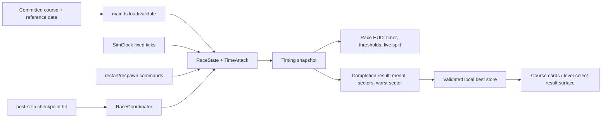

# Phase 6: Medals & Time-Attack Loop - Research

**Researched:** 2026-09-21
**Domain:** Deterministic run timing, checkpoint splits, medal grading, local persistence, and race results UI
**Confidence:** HIGH for current repository contracts and Phase 5 handoff; MEDIUM for the exact persistence schema and browser presentation because those surfaces do not exist yet

<user_constraints>
## User Constraints (from CONTEXT.md)

### Locked Decisions

- **D-01:** Use one fixed percentage-band formula for every course rather than hand-authoring unrelated thresholds per level. This keeps medal difficulty comparable and makes re-recording after a handling change predictable.
- **D-02:** Use the designer reference run as the 100% baseline. Default bands are Ace at <=90% of reference, Gold at <=100%, Silver at <=115%, and Bronze at <=135%; slower results receive no medal. Keep the percentages in one documented, versioned tuning contract so they can be re-recorded deliberately after handling changes.
- **D-03:** Reference runs are recorded per course and mode using the fixed simulation clock, with the current shipped handling tune locked before recording. Reference data is content, not a player's saved best time.
- **D-04:** The run timer starts on first meaningful vehicle movement, not page load. The pre-drive state and any brief setup time do not count.
- **D-05:** The timer is derived from the fixed simulation clock and never from wall-clock frame delta. Respawn keeps the clock running and adds the existing flat retry penalty to the effective run time; restart creates a fresh attempt with zero elapsed time and zero penalty.
- **D-06:** A completed run freezes its final effective time and medal result for the results view. Only a valid completed run can update a saved best.
- **D-07:** Persist best results per stable course ID, storing best effective time, medal, and enough schema/version information for safe future migration. Corrupt or incompatible saved data must be ignored without crashing or wiping unrelated progress.
- **D-08:** Present results as course cards in the level-select/results surface. Each P2P or Circuit card shows the best time, earned medal, and the four threshold times for that course; unavailable results remain visibly unearned rather than being represented by fake zero values.
- **D-09:** Personal bests are local-browser progress only. Do not add accounts, online leaderboards, or cross-device synchronization.
- **D-10:** Use checkpoint-to-checkpoint intervals as sectors. A run records each sector's elapsed time and cumulative delta as checkpoints are hit.
- **D-11:** Live split feedback compares the current run against the personal best when one exists; otherwise it compares against the relevant target medal/reference split. The HUD must make the comparison source clear.
- **D-12:** Circuit results expose sectors across laps, preserving lap and checkpoint identity. The post-run table highlights the single slowest sector and includes enough context to locate the corner/interval that cost the most time.
- **D-13:** P2P and Circuit share one pure timing/medal/split contract; mode-specific differences are course metadata and lap labeling, not separate timing rules.

### Claude's Discretion

- Exact persistence schema field names and migration implementation.
- Exact first-movement threshold, provided it is deterministic and does not count stationary setup time.
- Exact HUD placement and typography, while respecting Phase 5's top-right speedometer and bottom-left minimap layout.
- Exact reference-run authoring tool/workflow, provided it produces deterministic committed course data and does not depend on a player's local best.
- Exact audio/visual result feedback, provided it does not obscure the driving or introduce a new narrative system.

### Deferred Ideas (OUT OF SCOPE)

- Ghost-car playback remains a v2 requirement and is explicitly excluded from this phase.
- Online leaderboards, accounts, and cross-device synchronization remain out of scope.
- Additional courses, maps, cars, and configurable tuning/customization remain out of scope.
</user_constraints>

<phase_requirements>
## Phase Requirements

| ID | Description | Research Support |
|----|-------------|------------------|
| NAV-02 | Player sees a live run timer with medal thresholds visible before and during the run | Use a fixed-tick timing snapshot driven by `SimClock.simTimeSec`; expose all four derived threshold times to the HUD before movement and while active. |
| MEDAL-01 | Player earns one of four medal tiers per level based on completion time, with thresholds derived from a fixed percentage of a designer reference run | Store committed per-course reference seconds and derive Ace/Gold/Silver/Bronze through one versioned percentage contract. |
| MEDAL-02 | Player's best time per level persists across sessions and is visible on a medal grid at level select | Add validated versioned local storage keyed by stable course ID and a minimal course-card/results surface around the existing mode/course entry point. |
| MEDAL-03 | Player sees a live split-time delta vs. personal best or target medal at each checkpoint during a run | Capture checkpoint events in `RaceCoordinator.onTickEnd()` and compare cumulative checkpoint time to PB or target/reference cumulative split data. |
| MEDAL-04 | Player sees a post-run sector breakdown table with the worst sector highlighted | Freeze completed run sectors, retain checkpoint/lap identity, and render a results table with the maximum sector interval highlighted. |
</phase_requirements>

## Summary

[VERIFIED: codebase] The authoritative clock is `SimClock.simTimeSec`, defined as `tick * DT`; `src/core/sim-clock.ts` has no wall-clock read. [VERIFIED: codebase] `src/loop.ts` advances the clock in fixed ticks, calls `onTickEnd` after each `world.step()`, and calls render/HUD once per animation frame. Phase 6 should therefore add a pure run-timing contract and sample it at fixed-tick boundaries, never derive elapsed time from `dtMs`, `performance.now()`, or render frequency.

[VERIFIED: codebase] `RaceState` already owns `penaltySec`, `effectiveTimeSec(simTimeSec)`, `respawn()`, `restart()`, completion, lap, and checkpoint identity. [VERIFIED: codebase] `RaceCoordinator.onTickEnd()` is the post-step event boundary where accepted checkpoint hits are known. The smallest reliable design is to extend the race-domain snapshot/event contract so one timing component receives accepted checkpoint hits and the current simulation time, while `RaceState` remains the owner of retry penalty and progression rules.

[VERIFIED: codebase] No standalone level-select or results view exists. `src/main.ts` selects P2P by default and Circuit through `?mode=circuit`; `createRaceHud()` currently renders only target/lap/checkpoint and wrong-way feedback. Phase 6 must introduce a minimal course-card/results surface without turning this phase into a full menu system. [ASSUMED] A DOM overlay that can show the current course card before/after a run and preserve the existing query-parameter entry path is the lowest-risk integration.

**Primary recommendation:** Create one pure `time-attack` core contract containing first-movement timing, medal thresholds, cumulative checkpoint splits, frozen completion results, and deterministic persistence parsing; wire it through `RaceCoordinator` and a richer `RaceHud`, while keeping reference data committed beside course content and local storage at the composition/UI edge.

## Architectural Responsibility Map

| Capability | Primary Tier | Secondary Tier | Rationale |
|------------|-------------|----------------|-----------|
| First-movement timer and attempt lifecycle | Browser / Client fixed-tick gameplay | `SimClock`, `RaceState` | The timer must observe fixed ticks and restart/respawn commands, not browser time. |
| Checkpoint split capture | Browser / Client gameplay coordinator | Pure timing contract | Coordinator already owns accepted post-step checkpoint hits; the pure contract should calculate intervals and deltas. |
| Medal threshold derivation | Browser / Client core/content | `public/maps` course data | Formula and reference seconds are deterministic content and must be testable without DOM/physics. |
| Best-time persistence | Browser / Client storage adapter | Pure schema parser/migrator | `localStorage` is the only v1 persistence boundary; parsing must be isolated from gameplay and tolerate hostile/corrupt input. |
| Live timer/split HUD | Browser DOM HUD | Timing snapshot | HUD renders read-only snapshots and must never decide medals or mutate race state. |
| Results/course cards | Browser DOM UI | Persistence store and course metadata | The browser currently has no level-select screen; a minimal DOM surface can present stable course IDs, thresholds, PBs, and completed results. |
| Reference-run authoring | Repository content/tooling | Fixed simulation harness | Reference data must be committed, reproducible, and independent of player storage. |

## Standard Stack

### Core

| Library / contract | Version | Purpose | Why standard |
|---|---:|---|---|
| `SimClock` / fixed loop | Repository contract | Authoritative elapsed time | Already enforces framerate-independent ticks and stall recovery. |
| TypeScript + Vite | 7.0.2 / 8.2.2 [VERIFIED: package.json] | Browser build and typed contracts | Existing exact-pinned project stack. |
| Vitest | 5.0.0 [VERIFIED: package.json] | Pure timing, medal, persistence, and integration tests | Existing test runner; current core tests run in Node without DOM. |
| DOM APIs | Browser platform [VERIFIED: `src/hud/race-hud.ts`, `src/hud/minimap.ts`] | Timer, split, result, and course-card presentation | Existing HUD convention uses direct DOM writes, `textContent`, and disposable handles. |
| `localStorage` | Browser platform | Local best-result persistence | Explicit v1 decision; no accounts or backend. |

### Supporting

| Existing module | Use in Phase 6 |
|---|---|
| `src/core/race-state.ts` | Reuse `effectiveTimeSec`, penalty, restart, completion, lap, and checkpoint identity. |
| `src/gameplay/race-coordinator.ts` | Emit/forward accepted checkpoint completion samples and final completion snapshots. |
| `src/hud/race-hud.ts` | Extend the existing top-left race status without colliding with top-right speedometer or bottom-left minimap. |
| `src/core/course.ts` | Stable course IDs, mode, laps, and checkpoint order are the content key for reference data and PB storage. |
| `public/maps/juliette-ga.routes.json` | Current content contains `juliette-backroads-run` (P2P) and `juliette-three-lap-loop` (Circuit); IDs must not change casually. |
| `src/core/vehicle-tuning.ts` / `src/core/tuning-snapshot.ts` | Precedent for pure parse-or-default validation, explicit storage keys, schema versioning, and domain-local migration. |

**Installation:** No new package is recommended or required. Existing exact-pinned dependencies are sufficient.

## Package Legitimacy Audit

No external package installation is required for Phase 6. The recommended implementation uses only existing repository contracts and browser APIs; therefore there are no new packages to approve or gate.

## Architecture Patterns

### System Architecture Diagram



### Recommended Project Structure

```text
src/
├── core/
│   ├── time-attack.ts          # pure attempt lifecycle, thresholds, splits, result
│   └── time-attack-storage.ts  # pure schema parser/serializer/migration, if split is useful
├── gameplay/
│   └── race-coordinator.ts     # fixed-tick integration and accepted checkpoint events
├── hud/
│   └── race-hud.ts             # live timer/split and completed-results presentation
├── ui/
│   └── level-select.ts          # minimal course cards/PB grid, if separate from HUD
└── main.ts                     # compose references, storage adapter, HUD, coordinator
public/maps/
└── juliette-ga.routes.json     # stable course IDs/checkpoint identities
```

[ASSUMED] Exact module split is discretionary, but the timing and persistence parser should remain pure and Node-testable. Do not put `localStorage`, DOM, Three.js, or Rapier imports in `src/core`.

### Pattern 1: Fixed-tick attempt lifecycle

[VERIFIED: `src/core/sim-clock.ts`, `src/loop.ts`] Keep simulation time monotonic and separate from attempt elapsed time. A pure state machine should receive `simTimeSec` and vehicle movement information on each fixed tick:

```ts
interface TimeAttackInput {
  simTimeSec: number;
  speedMs: number;
  race: RaceSnapshot;
}

type AttemptPhase = "pre-drive" | "active" | "complete";
```

[ASSUMED] Use a deterministic first-movement predicate based on a small speed threshold and/or meaningful input, with the threshold documented and unit-tested. The safest default is a speed threshold derived from fixed-tick vehicle state, not input alone, so a stationary throttle input does not start the run if the car has not moved. On the first qualifying tick, record `startedAtSimSec`; active elapsed time is `simTimeSec - startedAtSimSec`. On restart, reset the attempt phase/start anchor/penalty/splits. On respawn, preserve the start anchor and let `RaceState.penaltySec` flow into effective time.

Do not start timing at page load or on the first render. Do not use `dtMs` in the timing domain. Guard against non-finite or backwards inputs in pure functions so malformed integration cannot produce negative times.

### Pattern 2: Single percentage-band medal contract

[VERIFIED: Phase 6 CONTEXT D-01/D-02] Keep percentages and a contract version together:

```ts
const MEDAL_BANDS = {
  ace: 0.9,
  gold: 1.0,
  silver: 1.15,
  bronze: 1.35,
} as const;

type Medal = "ace" | "gold" | "silver" | "bronze" | "none";
```

For reference time `R`, derive thresholds as `R * band`. Classify in best-to-worst order with inclusive `<=` comparisons: Ace, Gold, Silver, Bronze, then no medal. Store/reference times in seconds with finite positive validation. The result must preserve both the raw final effective time and the awarded medal; do not recompute a historical medal from changed future bands when rendering a saved result unless the schema explicitly says results are regraded.

[ASSUMED] Use decimal seconds in committed reference data and persist full numeric seconds; format only at presentation. Avoid rounded display values as inputs to classification because boundary tests need the unrounded values.

### Pattern 3: Checkpoint-to-checkpoint sectors

[VERIFIED: Phase 6 CONTEXT D-10/D-12] On each accepted checkpoint hit, pass the current effective elapsed time and checkpoint identity to the pure timing contract. The contract should store a sector record with at least: stable checkpoint ID, sequence index, lap (for Circuit), sector elapsed seconds, cumulative elapsed seconds, and comparison delta/source.

For the first checkpoint, define the sector start as the run start (or an explicit authored start marker), not an implicit prior checkpoint. For P2P, authored checkpoint order is the sector labeling order even though hit acceptance is unordered; if unordered routes can hit checkpoints in arbitrary order, preserve the actual previous checkpoint ID and hit sequence as well as authored identity so the results remain truthful. [ASSUMED] The planner should decide explicitly whether P2P sectors are authored-leg sectors or actual hit-to-hit intervals; D-10 says checkpoint-to-checkpoint, so actual accepted-hit order should be retained and displayed, while authored checkpoint labels provide location context.

For Circuit, key sectors by `lap + checkpointId` (or authored checkpoint index) so the same checkpoint on three laps cannot overwrite another. Highlight exactly one slowest sector by maximum finite sector time, using stable first-seen tie breaking.

### Pattern 4: Split comparison source

[VERIFIED: Phase 6 CONTEXT D-11] Define a comparison snapshot with an explicit source enum such as `"personal-best" | "target-medal" | "reference"`. If a valid PB exists, compare cumulative current time to the PB's cumulative split at the same sector identity. Otherwise compare against the selected target's cumulative reference split; if no target-specific split data exists, compare against the reference cumulative split and label it `reference`.

[ASSUMED] Because no split reference artifacts exist today, reference data should contain per-checkpoint cumulative split times, not only total time. A committed reference run needs the same checkpoint/lap identity sequence as the runtime course; total-only reference data cannot satisfy live split comparison without inventing sector times.

### Pattern 5: Validated local best persistence

[VERIFIED: `src/core/vehicle-tuning.ts`, `src/core/tuning-snapshot.ts`] Mirror the repository's safe persistence pattern: parse raw JSON inside a `try/catch`, reject non-plain top-level values, validate a recognized schema version and bounded finite fields, copy only known fields into a safe result, and return `null`/empty data for corrupt input. Keep course records independent so one malformed course record cannot erase unrelated progress.

Recommended shape:

```ts
interface MedalProgressStoreV1 {
  kind: "heat-street.medal-progress";
  version: 1;
  courses: Record<string, {
    bestTimeSec: number;
    medal: Medal;
    completedAt?: string;
  }>;
}
```

[ASSUMED] `completedAt` is optional and not required by the phase; omit it unless results UX needs it. More important fields are stable course ID, positive finite best time, and a recognized medal. The storage key should be versioned, for example `heat-street.medals.v1`. On unknown version, malformed JSON, invalid record, or invalid medal, ignore that record; preserve valid sibling records. A future migration should live in the parser module, not in `main.ts` or HUD code.

Only write after a completed, valid run and only when the new effective time improves the stored best. Do not write pre-drive, abandoned, restarted, or incomplete attempts. Reference times must never be stored in the player's progress blob.

### Pattern 6: Results/course-card integration

[VERIFIED: `src/main.ts`] The existing entry point loads one selected course and has no level-select screen; `?mode=circuit` changes the course. [ASSUMED] Add the smallest useful surface: a course/results panel that can show the selected course's title, mode, best time/medal, all threshold times, and a completed-run result table. If presenting both course cards in one grid, use the already-loaded route metadata and the progress store, but keep course selection compatible with the existing query parameter until a deliberate navigation control is planned.

[VERIFIED: existing HUD patterns] Keep the minimap bottom-left and speedometer top-right. Place timer/threshold/split content in the remaining top-left or upper-center space without obscuring driving. Use direct DOM nodes and `textContent`, not HTML string injection. Give the HUD a lifecycle with `update`, `showResult`, `showCourseCards`/equivalent, and `dispose`; keep core result data separate from DOM formatting.

## Don't Hand-Roll

| Problem | Don't Build | Use Instead | Why |
|---|---|---|---|
| Reproducible elapsed time | Wall-clock timer or render-frame accumulator | `SimClock.simTimeSec` and fixed-tick samples | Wall time/render cadence breaks medal comparability. |
| Medal classification | Per-level ad hoc `if` chains | One versioned percentage-band contract | D-01/D-02 require comparable and re-recordable thresholds. |
| Route/checkpoint identity | Array index or display name as storage key | Stable course IDs and checkpoint IDs from route data | Names/order can change; IDs are the existing content identity. |
| Untrusted save parsing | Direct `JSON.parse` at the call site | Pure parser/migrator patterned after tuning persistence | Corrupt local storage must not crash or wipe other courses. |
| Split deltas from total time only | Guessing sector durations | Store per-checkpoint/lap cumulative reference/PB splits | MEDAL-03 and MEDAL-04 need interval identity and comparison data. |
| Results rendering in core | DOM writes in timing/medal logic | Read-only snapshots passed to HUD/UI | Preserves layering and makes pure tests cheap. |
| New menu framework | Full routing/state package | Minimal DOM course-card/results surface | Current app has query-param mode selection and no menu dependency. |

## Common Pitfalls

### Pitfall 1: Starting the timer on page load or first render

**What goes wrong:** Setup/loading/brief time contaminates medal times. [VERIFIED: Phase 6 D-04]

**How to avoid:** Start only when the pure first-movement predicate becomes true on a fixed tick; add tests with long stationary setup followed by movement.

### Pitfall 2: Using render `dtMs` or browser wall time

**What goes wrong:** Timer values differ by refresh rate and can continue through a stall in ways the simulation did not. [VERIFIED: `src/loop.ts`, `src/core/sim-clock.ts`]

**How to avoid:** Store a simulation-time start anchor and derive elapsed time from `simTimeSec`; test identical scripted inputs at 30/60/144 Hz.

### Pitfall 3: Double-counting respawn penalty

**What goes wrong:** `RaceState.effectiveTimeSec` already adds `penaltySec`; adding the penalty again in a separate timer produces incorrect results. [VERIFIED: `src/core/race-state.ts`]

**How to avoid:** Define one ownership boundary: timing reads the base elapsed time plus the race state's effective penalty exactly once, or receives `effectiveTimeSec` from a single adapter. Test multiple respawns and restart-after-respawn.

### Pitfall 4: Resetting the timer outside the fixed-tick restart path

**What goes wrong:** HUD and core can disagree for a frame, or a restart during a multi-step frame can leave old checkpoint/split state alive. [VERIFIED: `src/loop.ts` command ordering and Phase 5 summaries]

**How to avoid:** Reset `RaceState`, timing attempt, split buffers, and presentation from `onRaceCommands`/coordinator in the existing fixed-tick command path; clear all split state on restart and retain no completion result.

### Pitfall 5: Treating an incomplete/zero result as a PB

**What goes wrong:** A restart or page close can write `0`, fake medal data, or a partial sector table. [VERIFIED: D-06/D-07]

**How to avoid:** Persist only a finite, positive final result from a completed race snapshot; represent unavailable PB as `null`/absence, never `0`.

### Pitfall 6: Regrading old PBs after reference or band changes

**What goes wrong:** Historical progress silently changes when handling/reference data is updated. [VERIFIED: D-02/D-03/D-07]

**How to avoid:** Persist awarded medal with the best time and schema/contract version. Treat reference data as committed content; re-record deliberately and document whether a future migration/regrade is intended.

### Pitfall 7: Losing Circuit lap identity

**What goes wrong:** The same checkpoint ID occurs every lap and sector rows overwrite or become ambiguous. [VERIFIED: D-12 and `Course.laps`]

**How to avoid:** Use a sector key including lap and checkpoint index/ID; test all 3 laps and assert 15 sectors for the current five-checkpoint Circuit.

### Pitfall 8: Assuming P2P authored order is actual hit order

**What goes wrong:** P2P accepts any unvisited checkpoint, so sector attribution can lie if it assumes the authored array was followed. [VERIFIED: `RaceState.hitCheckpoint`/P2P tests]

**How to avoid:** Preserve actual accepted hit sequence and previous checkpoint context. Decide and document whether the display labels actual intervals or authored route legs before implementation.

### Pitfall 9: One corrupt save record invalidates every course

**What goes wrong:** A single bad JSON field or course ID blocks all medal progress. [VERIFIED: tuning persistence precedent; D-07]

**How to avoid:** Validate the envelope and each course record independently; retain only valid known-course records, and never call `localStorage.clear()`.

### Pitfall 10: Treating the current Phase 5 handoff as fully signed off

**What goes wrong:** Phase 5 summaries say all plans are complete, but the browser visual checkpoint remains pending and `.planning/ROADMAP.md`/`.planning/STATE.md` still report Phase 5 as 3/4 or 2/4 depending on the file. [VERIFIED: Phase 5 summary, ROADMAP, STATE, git status]

**How to avoid:** Before Phase 6 implementation, reconcile planning state and run the browser smoke for both modes. Keep Phase 6 automated tests independent of that manual gap, but do not call the phase gate complete without recording the result.

### Pitfall 11: Recording reference times against stale handling

**What goes wrong:** Current hand-tuned vehicle defaults are explicitly known to fail the old Phase 2 0-60/braking bands, so reference times recorded before a retune become stale. [VERIFIED: `STATE.md`, `vehicle-tuning.ts`, Phase 5 summary]

**How to avoid:** Lock the shipped handling values, run deterministic reference authoring, commit the reference artifact, and attach its tuning/content contract version. Re-record after any later handling change; never silently compare new runs to old reference data.

## Code Examples

### Effective completion time and medal classification

```ts
export type Medal = "ace" | "gold" | "silver" | "bronze" | "none";

export const MEDAL_CONTRACT_VERSION = 1;
export const MEDAL_BANDS = {
  ace: 0.9,
  gold: 1.0,
  silver: 1.15,
  bronze: 1.35,
} as const;

export function medalThresholds(referenceTimeSec: number) {
  return {
    ace: referenceTimeSec * MEDAL_BANDS.ace,
    gold: referenceTimeSec * MEDAL_BANDS.gold,
    silver: referenceTimeSec * MEDAL_BANDS.silver,
    bronze: referenceTimeSec * MEDAL_BANDS.bronze,
  };
}

export function classifyMedal(timeSec: number, referenceTimeSec: number): Medal {
  const thresholds = medalThresholds(referenceTimeSec);
  if (timeSec <= thresholds.ace) return "ace";
  if (timeSec <= thresholds.gold) return "gold";
  if (timeSec <= thresholds.silver) return "silver";
  if (timeSec <= thresholds.bronze) return "bronze";
  return "none";
}
```

Source: [VERIFIED: Phase 6 CONTEXT D-01/D-02]; exact implementation must add finite/positive input guards and boundary tests.

### Safe storage adapter boundary

```ts
export interface MedalStorage {
  get(key: string): string | null;
  set(key: string, value: string): void;
}

export function loadMedalProgress(storage: MedalStorage): MedalProgressStoreV1 {
  const raw = storage.get(MEDAL_STORAGE_KEY);
  const parsed = parseMedalProgress(raw);
  return parsed ?? emptyMedalProgress();
}
```

Source: [VERIFIED: `src/core/vehicle-tuning.ts`, `src/debug/tuning-panel.ts`]; keep the parser pure and inject the adapter so Vitest does not need a browser `localStorage`.

## Phase 5 Handoff Audit

| Area | Current evidence | Phase 6 impact / action |
|---|---|---|
| Planning state | [VERIFIED: `.planning/STATE.md`] says Phase 5 is in progress at 2/4 and next is `05-03-PLAN.md`; [VERIFIED: ROADMAP] says 3/4; four Phase 5 summaries and four implementation plans exist in the worktree. | Treat planning metadata as stale until reconciled. Do not use the stale “current focus” as proof that coordinator APIs are absent. |
| Source changes | [VERIFIED: `git status`] `race-coordinator.ts`, HUD/minimap/navigation files and tests are modified/uncommitted in the current worktree. | Preserve them; inspect the actual current files before implementation and avoid assuming the committed HEAD alone is the handoff. |
| Browser sign-off | [VERIFIED: `05-04-SUMMARY.md`] HTTP smoke/build passed, but desktop Chromium visual checkpoint was unavailable and remains pending. | Run/record P2P and Circuit browser smoke before or during Phase 6 UI work; results overlay must not conceal existing layout defects. |
| Timer seam | [VERIFIED: `src/main.ts`] `simTimeSec: () => 0` is passed to `createRaceCoordinator`; no timer exists. | Replace the stub with the fixed loop clock or a coordinator-owned fixed-tick timing adapter. Never derive it from render `dtMs`. |
| Race HUD | [VERIFIED: `src/hud/race-hud.ts`] only target/lap/checkpoint and wrong-way state are rendered. | Extend or compose the HUD with timer, thresholds, split source/delta, and frozen results; preserve `dispose` and direct DOM safety. |
| Race completion event | [VERIFIED: `RaceCoordinator`] `onTickEnd` calls `state.hitCheckpoint` but exposes no accepted-hit event or completion result. | Add a pure event/sample seam at the accepted-hit branch; do not infer completion from `visitedIds.length` in the HUD. |
| Handling/reference validity | [VERIFIED: `STATE.md`] current hand-tuned values make old 0-60/braking telemetry tests red by design; Phase 5 summary records those as pre-existing failures. | Reference runs are blocked until the shipped handling tune is deliberately locked and the stale telemetry-band decision is recorded. |
| Course identity | [VERIFIED: route sidecar/course parser] IDs are `juliette-backroads-run` and `juliette-three-lap-loop`; Circuit has five checkpoints and three laps. | Use IDs as storage/reference keys; preserve checkpoint IDs for split migration. |

## Validation Architecture

### Test Framework

| Property | Value |
|---|---|
| Framework | Vitest 5.0.0 [VERIFIED: `package.json`] |
| Config file | `vite.config.ts` / existing Vitest setup [VERIFIED: repository scripts and current tests] |
| Quick run command | `npm test -- --run tests/time-attack.test.ts tests/time-attack-storage.test.ts tests/race-state.test.ts tests/race-coordinator.test.ts` |
| Full suite command | `npm test` |
| Type check | `npm run typecheck` |
| Build smoke | `npm run build` |

### Phase Requirements -> Test Map

| Req ID | Behavior | Test Type | Automated Command | File Exists? |
|---|---|---|---|---|
| NAV-02 | Timer stays zero during setup, starts at first meaningful movement, advances by fixed simulation time, and exposes four thresholds | Unit | `npm test -- --run tests/time-attack.test.ts` | No, Wave 0 |
| MEDAL-01 | 90/100/115/135% inclusive boundaries classify Ace/Gold/Silver/Bronze; slower is no medal; reference data validates | Unit | `npm test -- --run tests/time-attack.test.ts` | No, Wave 0 |
| MEDAL-02 | Valid PB round-trip, invalid envelope/record isolation, unknown version handling, only completed improvements persisted | Unit | `npm test -- --run tests/time-attack-storage.test.ts` | No, Wave 0 |
| MEDAL-03 | Accepted checkpoint samples capture cumulative/sector times and compare PB first, target/reference otherwise; restart clears them; respawn preserves run | Unit/integration | `npm test -- --run tests/time-attack.test.ts tests/race-coordinator.test.ts` | Partial existing coordinator; new timing tests needed |
| MEDAL-04 | P2P and all 15 Circuit sectors retain identity; final result freezes; exactly one slowest sector is highlighted | Unit | `npm test -- --run tests/time-attack.test.ts` | No, Wave 0 |
| UI integration | HUD formats thresholds/timer/split/result safely and does not collide with existing overlays | DOM/unit or browser smoke | `npm test -- --run tests/race-hud.test.ts`; `npm run dev -- --host 127.0.0.1` for visual check | No HUD test; browser checkpoint pending |
| Determinism | Same scripted tick input at 30/60/144 Hz yields identical completion time/splits/result | Integration | `npm test -- --run tests/determinism.test.ts tests/time-attack.test.ts` | Existing determinism test; extend with timing fixture |

### Sampling Rate

- Per task commit: `npm test -- --run <focused Phase 6 tests>`
- Per wave merge: `npm run typecheck && npm test -- --run <Phase 6 tests>`
- Phase gate: `npm run typecheck && npm test && npm run build`, then browser smoke for both `/?mode=p2p` and `/?mode=circuit`

### Wave 0 Gaps

- [ ] `tests/time-attack.test.ts` — pure attempt lifecycle, medal bands, split capture, completion freeze, P2P/Circuit sector identity, restart/respawn behavior.
- [ ] `tests/time-attack-storage.test.ts` — round-trip, hostile JSON, unknown schema, invalid sibling record isolation, best-only update behavior.
- [ ] `tests/race-hud.test.ts` or equivalent pure formatting test — threshold/time/delta formatting and unavailable-PB presentation.
- [ ] Committed reference-data fixture for both stable course IDs, including total reference seconds and cumulative checkpoint/lap splits. This is content plus validation, not a test-only mock.
- [ ] A deterministic first-movement fixture that makes the chosen threshold explicit.

## Security Domain

### Applicable ASVS Categories

| ASVS Category | Applies | Standard Control |
|---|---|---|
| V2 Authentication | No | No accounts in v1; keep out of scope. |
| V3 Session Management | No | No server session; local browser progress only. |
| V4 Access Control | No | No multi-user resource boundary. |
| V5 Input Validation | Yes | Validate all localStorage JSON, schema/version, course IDs, medal enum, and finite positive times before use. |
| V6 Cryptography | No | No security token or integrity claim; local PB is not authoritative/anti-cheat protected. |

### Known Threat Patterns for browser-local progress

| Pattern | STRIDE | Standard Mitigation |
|---|---|---|
| Malformed localStorage JSON | Tampering / Denial of service | `try/catch`, plain-object/schema checks, safe empty fallback. |
| `NaN`, `Infinity`, negative/zero best time | Tampering | Require finite positive values and bounded record count/IDs; ignore invalid records. |
| Unknown future schema version | Tampering / Denial of service | Reject or migrate explicitly; never interpret unknown fields as v1. |
| HTML injection through course/result text | Tampering | Use `textContent` and direct DOM properties; course data is still untrusted at the presentation boundary. |
| False security assumptions about PB | Repudiation | Document that local progress is player-local and not an online authoritative score. |

## Environment Availability

| Dependency | Required By | Available | Version | Fallback |
|---|---|---:|---:|---|
| Node.js | Vitest/build/typecheck | Yes | Engine requires >=24; version should be checked at execution | None; install/use supported Node if missing |
| npm | Scripts and existing pinned dependencies | Yes | Existing workspace uses npm | None |
| Vitest | Automated validation | Yes | 5.0.0 in `package.json` | None without changing project tooling |
| Chromium/browser | HUD and Phase 5 visual smoke | Not verified in this research session | — | Headless/unit tests cover pure behavior; manual/browser gate remains required for layout |

## State of the Art

| Old/current approach | Phase 6 approach | Impact |
|---|---|---|
| Phase 5 coordinator receives `simTimeSec: () => 0` | Fixed-tick timing snapshot sourced from `SimClock.simTimeSec` | Enables real deterministic timing without a second clock. |
| Race HUD shows only target/lap/wrong-way | HUD additionally shows timer, thresholds, split source/delta, and frozen result | Satisfies NAV-02/MEDAL-03/MEDAL-04 while preserving existing map/speedometer layout. |
| No persistent race progress | Versioned per-course local best records | Adds local replay value while remaining offline/browser-local. |
| No reference artifact | Committed per-course reference totals and cumulative splits | Makes percentage medals and live fallback splits computable and re-recordable. |

**Deprecated/outdated for this phase:**

- Do not use `Date.now()`, `performance.now()`, render `dtMs`, or a new accumulator for medal timing. [VERIFIED: project fixed-timestep decisions]
- Do not use tuning-panel storage or reference times as one shared blob. Tuning values are developer/debug state; reference runs are committed content; player PBs are separate local progress. [VERIFIED: existing tuning snapshot separation plus Phase 6 decisions]

## Assumptions Log

| # | Claim | Section | Risk if Wrong |
|---|---|---|---|
| A1 | First movement should be determined by a documented fixed-tick speed threshold, possibly combined with meaningful input. | Pattern 1 | Too-low threshold starts while stationary; too-high threshold ignores slow starts. |
| A2 | Reference data should include cumulative checkpoint/lap split times, not only total time. | Pattern 4 / Wave 0 | Without it, live fallback splits cannot be truthful. |
| A3 | P2P sector display should retain actual accepted checkpoint order plus stable checkpoint identity. | Pattern 3 / Pitfall 8 | A different authored-order interpretation changes the results table semantics. |
| A4 | A minimal DOM course-card/results panel can coexist with query-param course selection for this phase. | Summary / Pattern 6 | A larger navigation redesign would expand scope and change the plan. |
| A5 | Browser Chromium is not currently verified/available to this research session. | Environment Availability | Visual HUD integration may require a manual checkpoint outside automated tests. |

## Open Questions

1. **What exact first-movement threshold best matches the vehicle's scale and slow starts?**
   - What we know: it must be deterministic and exclude stationary setup; vehicle speed is available from fixed-tick physics.
   - What's unclear: the minimum speed that feels like intentional movement rather than suspension jitter.
   - Recommendation: expose one named constant, test it against zero/jitter/slow-roll fixtures, and tune it before recording references.

2. **Are reference runs available for the two current courses?**
   - What we know: no reference artifact exists in the inspected route sidecar or source tree.
   - What's unclear: who records them and whether browser driving or a deterministic input tape is the authoring path.
   - Recommendation: add a deterministic authoring harness or committed fixture workflow before the UI claims meaningful medal thresholds; do not ship fake zero/default reference times.

3. **Should Phase 6 reconcile stale Phase 5 planning metadata before implementation?**
   - What we know: summaries/source indicate four Phase 5 plans, while STATE and ROADMAP disagree about completion; browser sign-off is pending.
   - What's unclear: whether the GSD orchestrator will repair those documents as part of phase transition.
   - Recommendation: make reconciliation a planning prerequisite/checkpoint, not a production-code task; record the browser result and update state consistently before Phase 6 completion.

4. **How should current handling retune affect reference recording?**
   - What we know: current defaults deliberately fail stale Phase 2 acceleration/braking bands, and the project says reference times follow a locked handling tune.
   - What's unclear: whether the tune is now final for Phase 6.
   - Recommendation: require an explicit handling-lock decision before reference authoring; attach a content/tuning version to reference data.

## Sources

### Primary (HIGH confidence)

- `.planning/phases/06-medals-time-attack-loop/06-CONTEXT.md` - locked Phase 6 decisions and scope.
- `.planning/REQUIREMENTS.md` - NAV-02 and MEDAL-01..04 acceptance requirements and v2 exclusions.
- `.planning/ROADMAP.md` - Phase 6 goal, success criteria, dependencies, and progress state.
- `.planning/STATE.md` - fixed-clock decisions, Phase 5 handoff, stale planning state, and handling retune caveat.
- `src/core/sim-clock.ts` - `tick * DT` simulation-time contract.
- `src/loop.ts` - fixed-tick ordering, retry command path, and post-step `onTickEnd` boundary.
- `src/core/race-state.ts` - progression, completion, penalty, restart, and effective-time contract.
- `src/gameplay/race-coordinator.ts` - checkpoint acceptance and current presentation integration.
- `src/hud/race-hud.ts` - existing DOM HUD surface and lifecycle.
- `src/core/vehicle-tuning.ts`, `src/core/tuning-snapshot.ts` - validated persistence precedents.
- `tests/determinism.test.ts`, `tests/race-state.test.ts`, `tests/loop.test.ts`, `tests/race-coordinator.test.ts` - current validation patterns.
- `public/maps/juliette-ga.routes.json`, `src/core/course.ts` - stable course/checkpoint/lap data shape.
- `package.json` - exact pinned versions and available test/build commands.

### Secondary (MEDIUM confidence)

- None required; this research is intentionally grounded in the current repository and locked phase context. Exact UI/persistence shape recommendations marked `[ASSUMED]` remain planner decisions.

## Metadata

**Confidence breakdown:**
- Standard stack: HIGH - existing exact-pinned packages and browser APIs are sufficient; no new dependency is needed.
- Architecture: HIGH - fixed loop, race state, coordinator, and HUD ownership are directly visible in source.
- Persistence schema: MEDIUM - repository validation patterns are clear, but the medal schema and migrations are new.
- Reference authoring: MEDIUM - the phase contract is explicit, but no committed reference artifact/workflow currently exists.
- Browser presentation: MEDIUM - DOM conventions are established, but Phase 5 visual sign-off remains pending.

**Research date:** 2026-09-21
**Valid until:** 2026-10-21 for repository contracts; re-check before planning if Phase 5 handoff or handling defaults change.
